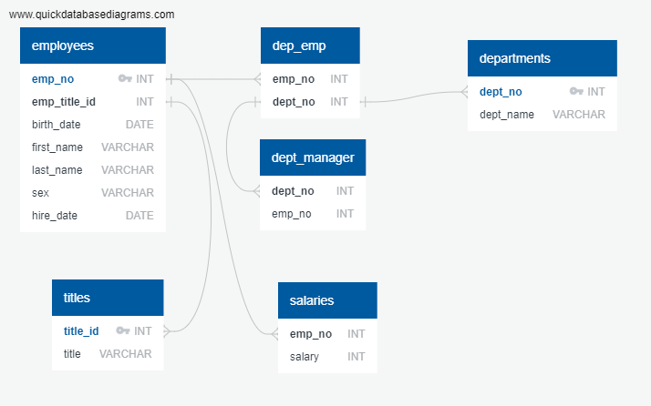
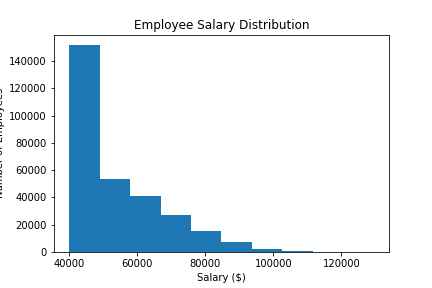
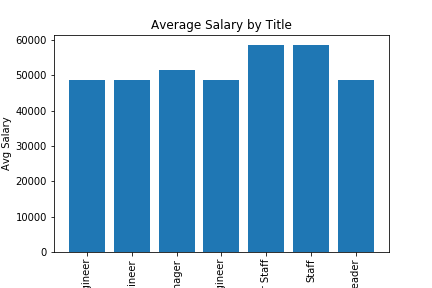

# SQL-challenge
Create and query employee data tables using SQL statements.  Inspect data and create an Entity Relationship Diagram to model the data tables and relationships.  Create table structures and import data.  Analyze data using SQL queries.  Use Pandas with SQLAlchemy to create data visualizations.

